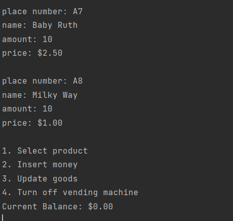

# vending-machine

1. Download project
2. Open CLI in project folder. Do follow command:
    - mvn clean install
    - java -jar [patch/to/jar/file]

This project simulates the operation of a vending machine. First, it reads the list of products from the json file 
located in project folder 'resources'. Displays a list of products and available operations.

Operations money inserting, product buying, product list updating log in log file